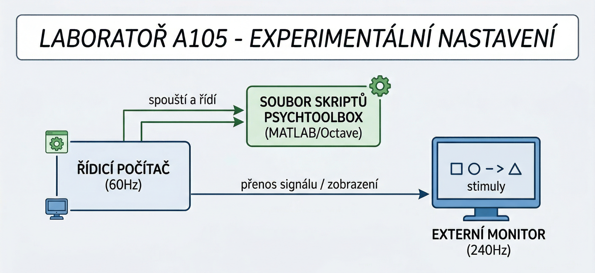
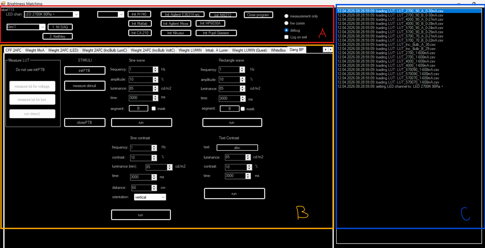
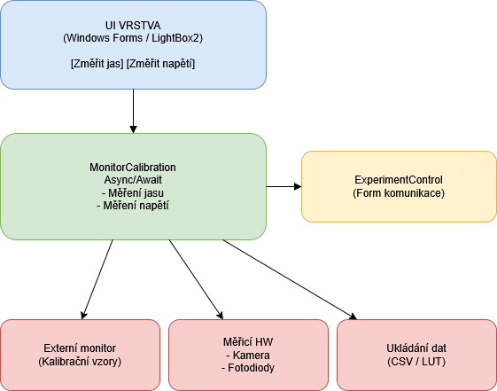
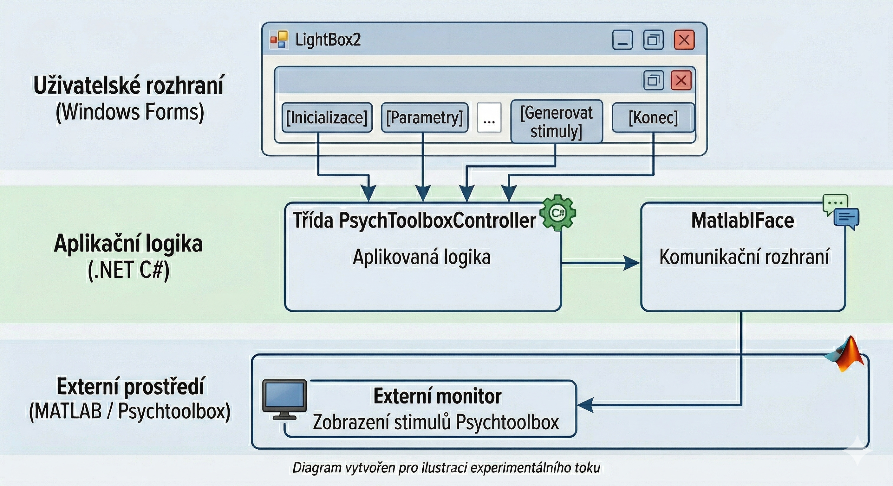

# Koncept projektu

Tento dokument popisuje základní koncept aplikace, její strukturu a rozdělení uživatelského rozhraní. Aplikace slouží k psychofyzikálním měřením a kalibraci monitorů v laboratorním prostředí.

## Přehled sestavy

Experimentální sestava se skládá z laboratorního PC s primárním monitorem 60 Hz a externim monitorem 240 Hz. Mohou byt pripojeny i další externí měřicí přístroje jako je kamera či fotodioda. Všechny tyto přístroje jsou propojeny do jednoho celku a jsou řízeny pomocí aplikace.

*Obrázek 1: Experimentální sestava.*

---

## Uživatelské rozhraní (UI)

### Rozdělení UI:
Hlavní rozhraní aplikace je rozděleno do několika částí.
- **Část A:** Inicializace a nastavení aplikace.
- **Část B:** Hlavní pracovní plocha, kde se provede mereni nebo spusti podnět.
- **Část C:** Logy, progress mereni

*Obrázek 2: Hlavní okno aplikace s vyznačenými částmi A, B a C.*

Pro přístup k funkcím vyvíjeným v rámci této práce slouží speciální záložka:

*Obrázek 3: Detail přepínače na záložku bakalářské práce.*

Tip.
pokud tuto konkrétní záložku nevidíte, musíte 2x stisknout šipku vpravo u tlačítek pro přepínání záložek.

---

## Hlavní moduly

### Modul pro měření
Slouží k interakci s hardwarem a sběru dat o jasu a napětí.

*Obrázek 4: Náhled rozhraní pro konfiguraci měření LUT tabulek.*

### Modul pro stimuly
Umožňuje definovat a vykreslovat vizuální podněty na monitoru.

*Obrázek 5: Nahled rozhraní pro výběr a spouštění vizuálních stimulů.*

---
[Zpět na README](README.md)