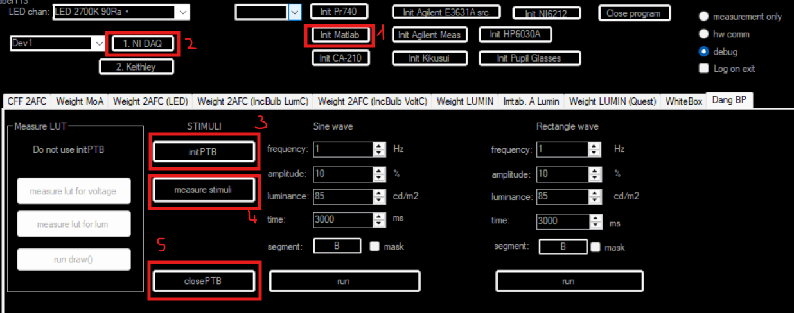

# Návod pro měření LUT tabulek

Tento dokument popisuje postup při vytváření LUT (Look-Up Table) tabulek, které zajišťují správnou kalibraci barev a jasů monitoru.

## Kalibrace monitoru

Před vlastním měřením je nutné provést základní kalibraci monitoru, aby následné vytváření LUT tabulek bylo co nejpřesnější. Spusť jeden podnět podle obrázku a pak manuálně kalibruj jas monitoru podle toho, co požaduješ.

*Obrázek 1: Spuštění jednoho podnětu pro kalibraci monitoru.*

---

## Postup měření LUT

Vlastní měření probíhá automatizovaně na základě zvolených úrovní signálu. Výsledky jsou klíčové pro zobrazení podnětů.

### Měření jasu

Měření jasu se provádí pro celou škálu šedi (0–255). Tím se získá reálná charakteristika jasu použitého displeje. K měření se používá kamera.

*Obrázek 2: Spuštění měření jasu.*

### Měření napětí fotodiody

Pokud je připojen externí hardware, aplikace umožňuje měřit napětí na výstupu čidla. To slouží k ověření stability a přesnosti měřicího řetězce.

*Obrázek 3: Spuštění měření napětí fotodiody.*

*Obrázek 4: Spuštění měření pro kontrolu stability.*

---
[Zpět na README](README.md)