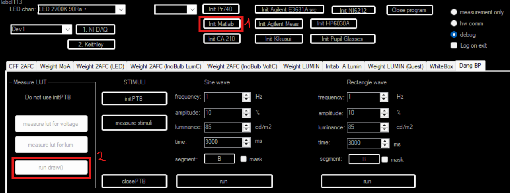
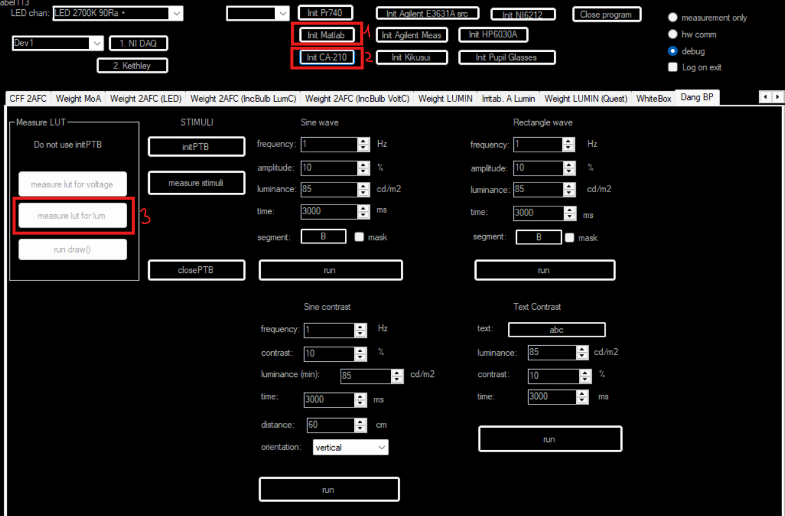
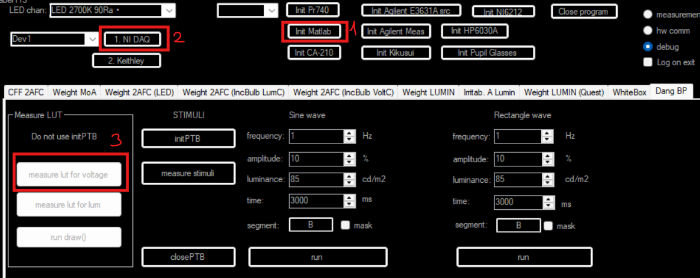

# Návod pro vytváření LUT tabulek

Tento dokument popisuje postup při vytváření LUT (Look-Up Table) tabulek, které zajišťují správnou kalibraci barev a jasů monitoru pro experimentální účely.

## Příprava a kalibrace monitoru

Před začátkem měření proveďte základní nastavení monitoru.

1. Spusťte testovací podnět (viz Obrázek 1).
2. Manuálně nakalibrujte jas monitoru na požadovanou výchozí hodnotu.

  
   
  <em>Obrázek 1: Postup spuštění testovacího podnětu.</em>

> [!IMPORTANT]
> **Zatemněte místnost.** Jakékoli okolní světlo zkresluje výsledky měření jasu.
---

## Měření jasu monitoru

Měření jasu probíhá pro celou škálu šedi (0–255). K měření použijte kalibrovanou kameru.

1. Připravte a zapněte kameru.
2. Zaostřete kameru na středovou oblast monitoru, kde se vykresluje podnět.
3. Spusťte automatické měření jasu (viz Obrázek 2).
   Měření trvá přibližně 45 minut.
4. Vytvoří se LUT tabulka ve formátu CSV, která mapuje RGB hodnoty a jas.

  
   
  <em>Obrázek 2: Postup spuštění měření jasu.</em>

## Měření napětí fotodiody

V případě použití fotodiody měřte napětí přímo na výstupu čidla.

1. Připojte fotodiodu k systému.
2. Spusťte měření napětí (viz Obrázek 3).
   Měření trvá přibližně 10 minut.
3. Vytvoří se LUT tabulka ve formátu CSV, která mapuje RGB hodnoty a napětí.

  
   
  <em>Obrázek 3: Postup spuštění měření napětí.</em>

---
[Zpět na README](README.md)
