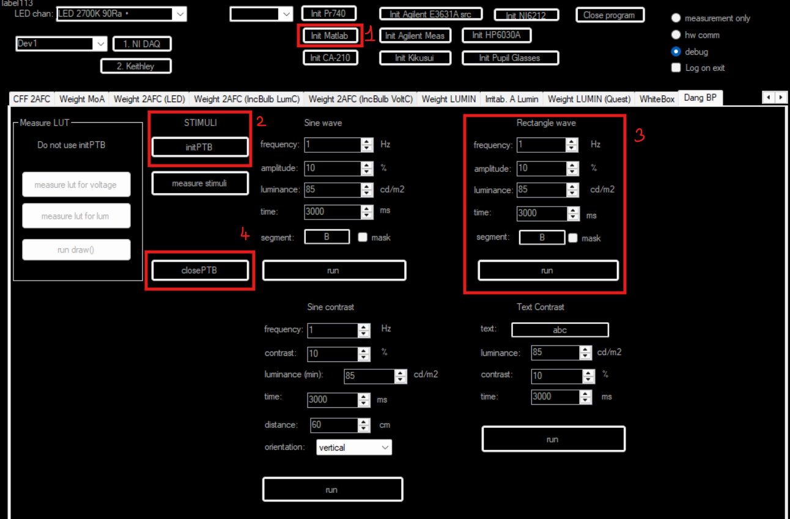
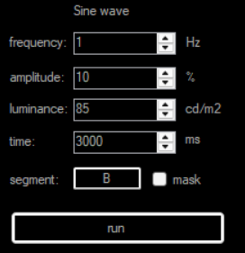
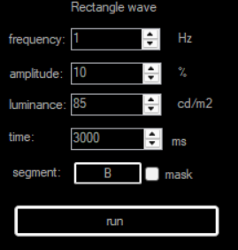
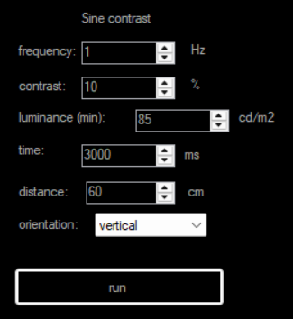
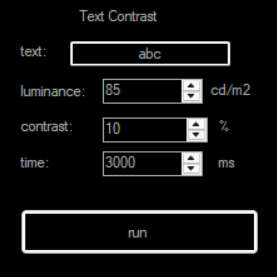

# Návod pro spouštění stimulů

Aplikace umožňuje generovat vizuální stimuly pro psychofyzikální experimenty, jako je testování viditelnosti blikání (flicker) nebo kontrastní citlivosti.

## Postup spuštění stimulu

1. Klikněte na záložku **Dang BP**.

> [!IMPORTANT]
> **Příprava před spuštěním:**
> - Zapněte externí monitor.
> - Klikněte na tlačítka pro inicializaci **MATLABu** v části A a **Psychtoolboxu** v části B.
> - Změřte a vytvořte **LUT tabulky** pro připojený monitor.

> [!TIP]
> Pokud záložku v horní liště nevidíte, klikněte 2x na šipku vpravo u přepínače záložek.

2. Vyberte typ stimulu a nastavte jeho parametry.
3. Stiskněte tlačítko **"Run"**.

Aplikace vykreslí stimul na externím monitoru.

*Obrázek 1: Konfigurace a spuštění stimulu.*

4. Podle parametrů muže stimul na externím monitoru vypadat například takto:

*Obrázek 2: Sinusový stimul.*

---

## Typy stimulů a parametry

### 1. Sinusový stimul (Sine Wave)
Slouží ke studiu viditelnosti flikru. Jas se mění plynule podle sinusové křivky.

**Nastavte parametry:**
- **Frekvence [Hz]:** Rychlost změn jasu.
- **Amplituda / Kontrast [%]:** Rozsah mezi maximálním a minimálním jasem.
- **Minimální jas [cd/m²]:** Spodní úroveň jasu.
- **Čas [ms]:** Doba trvání stimulu.
- **Segment & Mask:** Oblast monitoru a tvar stimulu.

*Obrázek 3: Konfigurace sinusového stimulu.*

### 2. Obdélníkový stimul (Rectangular)
Slouží ke stanovení kritické frekvence splývání (CFF). Jas skokově přechází mezi dvěma úrovněmi.

**Nastavte parametry:**
- **Frekvence [Hz]:** Rychlost změn jasu.
- **Amplituda / Kontrast [%]:** Rozsah mezi maximálním a minimálním jasem.
- **Minimální jas [cd/m²]:** Spodní úroveň jasu.
- **Čas [ms]:** Doba trvání stimulu.
- **Segment & Mask:** Oblast monitoru a tvar stimulu.

*Obrázek 4: Konfigurace obdélníkového stimulu.*

### 3. Sinusová mřížka (Grating)
Slouží ke studiu kontrastní citlivosti (TCSF).

**Nastavte parametry:**
- **Spatial Frequency [cyc/deg]:** Hustota mřížky.
- **Kontrast [%]:** Michelsonův kontrast.
- **Minimální jas [cd/m²]:** Jas pozadí.
- **Distance [cm]:** Pozorovací vzdálenost od monitoru.
- **Orientation:** Natočení mřížky.
- **Čas [ms]:** Doba trvání stimulu.

*Obrázek 5: Konfigurace sinusové mřížky.*

### 4. Textový kontrast (Text Contrast)
Slouží k testování čitelnosti textu.

**Nastavte parametry:**
- **Text:** Obsah textu.
- **Minimální jas [cd/m²]:** Jas pozadí.
- **Kontrast [%]:** Weberův kontrast textu vůči pozadí.
- **Čas [ms]:** Doba trvání stimulu.

*Obrázek 6: Konfigurace textu.*

---
[Zpět na README](README.md)
